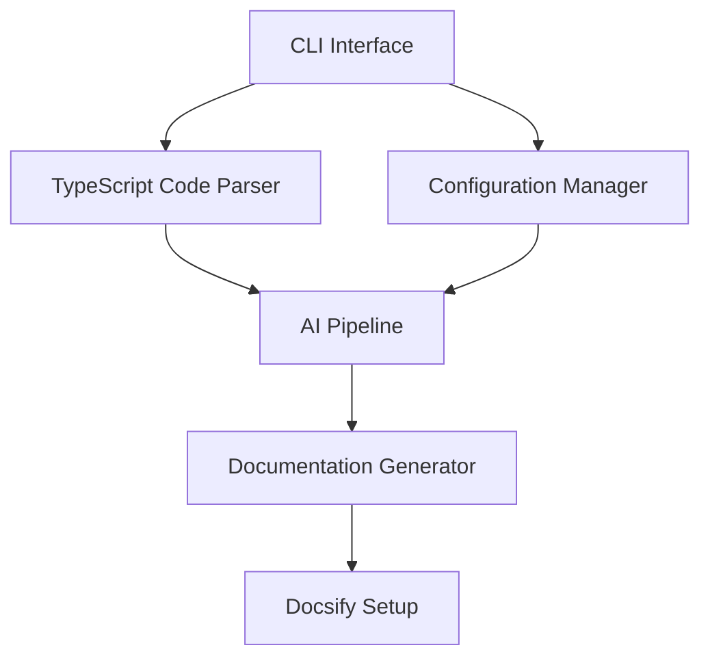

# Hermes – Product Requirements Document

## Overview

Hermes is an AI-powered command-line tool designed to automatically generate high-quality Markdown documentation for TypeScript projects. Built with modern AI capabilities, Hermes acts as a "virtual documentation writer" for your codebase.

- **Purpose**: Eliminate documentation tedium by using AI to understand code semantics and generate human-readable docs, allowing developers to focus on coding.
- **Target Users**: TypeScript developers who want comprehensive documentation without excessive time investment.

## User Personas

### Alex Chen - Senior Frontend Developer at a Mid-size SaaS Company

**Background:**
- 8 years of TypeScript experience
- Works on a team of 12 developers with shared codebase ownership
- Regular contributor to open-source UI libraries

**Pain Points:**
- Documentation constantly falls behind during sprint cycles
- New team members struggle to understand component architecture without proper docs
- Spends 15-20% of time writing and updating documentation

**Goals:**
- Reduce time spent on documentation while improving quality
- Standardize documentation format across the team
- Generate docs that include visual component hierarchies

**Usage Pattern:**
Alex would integrate Hermes into the CI/CD pipeline to automatically generate documentation when code is merged. They would use the GitHub Action integration for PR previews and configure high detail levels for API documentation with component visualization.

### Morgan Taylor - Solo Developer Building a TypeScript SDK

**Background:**
- 4 years of TypeScript experience
- Building and maintaining an open-source SDK
- Focused on developer adoption of their library

**Pain Points:**
- As a solo developer, documentation is often deprioritized
- Users frequently request better examples and use cases
- Struggles to write beginner-friendly tutorials while maintaining comprehensive API docs

**Goals:**
- Create professional documentation that enhances credibility
- Increase adoption through clear, comprehensive guides
- Balance time between coding and documentation

**Usage Pattern:**
Morgan would run Hermes locally during development cycles, focusing on the Diátaxis framework to create both tutorials and reference material. They would emphasize example generation and use Docsify for hosting on GitHub Pages.

### Jamie Rodriguez - Lead Developer at an Enterprise Company

**Background:**
- 12+ years of programming experience, 5 with TypeScript
- Manages a large-scale application with strict security requirements
- Responsible for onboarding new team members

**Pain Points:**
- Cannot share code with external services due to compliance requirements
- Documentation is scattered across wikis, code comments, and Confluence
- Knowledge silos form when senior developers leave

**Goals:**
- Centralize documentation in a secure, searchable system
- Ensure architectural decisions are well-documented
- Reduce onboarding time for new team members

**Usage Pattern:**
Jamie would use Hermes in local-only mode with privacy controls to ensure sensitive code isn't shared externally. They would focus on explanation and architectural documentation with MermaidJS diagrams to visualize system components.

### Riley Johnson - TypeScript Developer at a Fast-Growing Startup

**Background:**
- 3 years of TypeScript experience
- Works in a fast-paced environment with frequent pivots
- Responsible for both frontend and backend TypeScript code

**Pain Points:**
- Documentation quickly becomes outdated during rapid development
- Lacks time to write comprehensive docs during feature sprints
- Struggles to document complex type relationships

**Goals:**
- Keep documentation in sync with rapidly changing codebase
- Minimize documentation effort while maximizing usefulness
- Ensure API types are well-documented for team consumption

**Usage Pattern:**
Riley would run Hermes on a scheduled basis to detect and update outdated documentation. They would use the incremental update feature to focus on changed files and configure GitHub integration for documentation checks on PRs.

## Success Metrics

### Quantitative Metrics
- **Time Savings**: 70% reduction compared to manual writing
- **Adoption Rate**: 5,000 installs within 6 months
- **Documentation Coverage**: 95%+ of public APIs
- **Completion Rate**: 85%+ tasks without manual intervention
- **Error Rate**: <5% inaccuracies in generated documentation

### Qualitative Metrics
- **Documentation Quality**: Clarity, completeness, and usefulness via user surveys
- **User Satisfaction**: Net Promoter Score through in-tool feedback
- **Integration Ease**: Feedback on workflow integration

## Core Features

### Automatic Documentation Generation
AI-powered analysis of TypeScript code to produce documentation, using existing comments while filling gaps with meaningful descriptions, examples, and context.

### Documentation Structure (Diátaxis Framework)
Organizes documentation into four distinct types:
- **Tutorials**: Step-by-step guides for beginners
- **How-to Guides**: Task-oriented documentation for real-world use cases
- **Technical Reference**: Complete API documentation
- **Explanations**: High-level conceptual information on architecture and design

### Markdown-First Approach
- **Optimized Markdown Output**: Clean, well-structured Markdown files
- **Git-Friendly Documentation**: Version-controlled alongside code
- **Cross-References**: Proper linking between related documentation

### Docsify Integration
- **Zero-Build Documentation**: On-demand loading without compilation
- **Built-in Template**: Docsify configuration and setup files
- **Automatic Navigation**: Sidebar and navigation generation
- **Search Functionality**: Full-text search across documentation
- **Theme Configuration**: Light/dark mode and customizable styling
- **Plugin Support**: Integration with common Docsify plugins

### Customizable Styles & Detail Levels
- **Detail Level**: Configurable verbosity for documentation
- **Comment Inclusion**: Options for existing comments vs. AI extrapolation
- **Front-matter**: Customizable metadata for Markdown files
- **Style Guide Adherence**: Configurable documentation styles

### Visualization Support
- **MermaidJS Diagrams**: Code relationship and process visualizations
- **Component Hierarchy**: Visual component relationship representations
- **Data Flow Visualizations**: System data flow illustrations

### Integration with Developer Workflows
- **GitHub Integration**: Auto-generate docs via GitHub Actions
- **GitHub Pages Deployment**: Automated Docsify site publishing
- **CI/CD Pipelines**: Integration with build/deploy processes
- **Local Development**: CLI for real-time documentation

### Documentation Maintenance
- **Change Detection**: Identify when documentation needs updating
- **Versioning Support**: Track documentation with code versions
- **Documentation Linting**: Check for documentation issues
- **Doc Health Metrics**: Report on coverage and completeness
- **Auto-update Workflow**: Schedule documentation refreshes

## High-Level Architecture



Hermes uses a hybrid AI approach including:

1. **Planning System**: Analyzes codebase structure to create documentation strategy
2. **Documentation Generation**: Produces comprehensive content following best practices
3. **Quality Verification**: Validates accuracy and improves documentation quality
4. **Human-in-the-Loop**: Provides review capabilities for critical documentation

## User Workflow

### Installation and Setup
```bash
npm install -g hermes-docgen
# or as project dev dependency
npm install --save-dev hermes-docgen
```

After installation, initialize with `hermes init` to generate configuration.

### CLI Usage Examples

```bash
# Basic generation
hermes generate --output docs

# Using configuration file
hermes generate

# Adjusting detail level
hermes generate src/lib.ts --detail high --style formal

# Documentation verification
hermes verify

# Agent control mode
hermes generate --agent-mode balanced

# Initialize Docsify setup
hermes setup-docsify

# Deploy to GitHub Pages
hermes deploy
```

### Interactive CLI Experience

The CLI provides rich interactive experiences:

```bash
# Interactive configuration wizard
hermes init --interactive

# Guided documentation generation
hermes generate --guided

# Interactive review process
hermes review
```

### Configuration Options

- **Project Information**: Name, version, author
- **Source Include/Exclude**: Files/directories to document
- **Markdown Settings**: Headers, links, formatting preferences
- **Docsify Settings**: Theme, plugins, navigation options
- **Style Settings**: Detail level, writing style
- **AI Settings**: Model preferences, temperature settings
- **Agent Settings**: Control agent involvement level (minimal, balanced, extensive)
- **Authentication**: API key management
- **Documentation Structure**: Diátaxis organization options
- **Visualization Settings**: Diagram generation options

### Integration with GitHub & CI/CD

Example GitHub Actions workflow:

```yaml
on: push
jobs:
  docs:
    runs-on: ubuntu-latest
    steps:
      - uses: actions/checkout@v3
      - uses: actions/setup-node@v3
        with:
          node-version: '18.x'
      - run: npm ci
      - run: npx hermes generate --output docs
      - run: npx hermes setup-docsify
      - name: Deploy to GitHub Pages
        uses: peaceiris/actions-gh-pages@v3
        with:
          github_token: ${{ secrets.GITHUB_TOKEN }}
          publish_dir: ./docs
```

## Performance Expectations

Performance varies based on processing mode:

### Direct Processing
- **Small Projects** (<5,000 lines): 15-60 seconds
- **Medium Projects** (5,000-50,000 lines): 1-8 minutes
- **Large Projects** (>50,000 lines): 5-20 minutes

### Enhanced Processing
- **Small Projects** (<5,000 lines): 1-3 minutes
- **Medium Projects** (5,000-50,000 lines): 5-15 minutes
- **Large Projects** (>50,000 lines): 15-30 minutes

### Performance Optimization Features
- **Incremental Updates**: Only process changed files after initial generation
- **Parallel Processing**: Configure concurrent processing for large projects
- **Local Model Options**: Trade speed for quality with local deployment
- **Smart Context**: Intelligent context selection for improved efficiency
- **Caching**: Response caching to reduce API costs

## Security & Privacy

- **Optional local-only processing**: For sensitive codebases
- **Configurable data transmission controls**: Limit what gets sent to AI services
- **No training on user code**: Privacy-preserving by design
- **API key security**: Secure handling of authentication credentials
- **Sensitive data detection**: Pattern recognition to avoid exposing secrets

## Roadmap & Milestones

### Phase 1: MVP Release (Target: Q2 2025)
**Scope**: Basic CLI functionality generating Markdown documentation.

**Key Deliverables**:
- Hermes CLI with basic generation capabilities
- Simple Markdown output optimization
- Basic Docsify template generation
- Release as npm package v0.1.0

### Phase 2: Enhanced Features (Target: Q3 2025)
**Scope**: Advanced Docsify integration and core capabilities.

**Key Deliverables**:
- Advanced Docsify integration (themes, navigation, search)
- GitHub Pages deployment automation
- Diátaxis framework implementation
- Basic MermaidJS diagrams
- Documentation planning capabilities
- Smart context system basics
- Interactive documentation review
- Release v0.5.0

### Phase 3: Complete Solution (Target: Q4 2025)
**Scope**: Full workflow integration and enhanced capabilities.

**Key Deliverables**:
- GitHub Action and CI/CD integration
- Performance improvements for large codebases
- Complete agent system for quality verification
- Advanced context optimization
- Cost optimization features
- Documentation verification
- Security compliance features
- Web-based review interface
- Version 1.0 release

### Phase 4: Advanced Capabilities (Target: 2026)
**Scope**: Extensions based on user feedback.

**Potential Features**:
- Interactive documentation elements
- VS Code extension for documentation
- Multi-language support
- Enterprise features
- Optional expansion to other output formats

## Pricing Strategy

### Free Tier
- Open-source core CLI
- Basic documentation generation
- Community support
- Local development usage

### Pro Tier ($X/month per user)
- Advanced AI models
- Team collaboration features
- Priority support
- Advanced Docsify features

### Enterprise Tier (Custom pricing)
- On-premise deployment
- Custom integration support
- SLA guarantees
- Advanced security features

## Maintenance & Support

### Long-term Maintenance
- Regular TypeScript compatibility updates
- AI prompt improvements
- Security patches
- Performance optimization

### Support Channels
- GitHub Issues for bug reports
- Documentation and guides
- Community forum
- Optional premium support

## Conclusion

Hermes represents a significant advancement in documentation tooling for TypeScript projects. By leveraging modern AI capabilities, Hermes delivers a powerful yet flexible documentation generation system that integrates seamlessly with existing development workflows, saving developers time while producing high-quality documentation.
