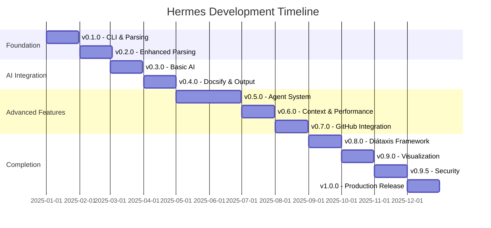

# ROADMAP.md

## Introduction

This roadmap outlines the development plan for Hermes, an AI-powered documentation generator for TypeScript projects. It details the progression from initial MVP (v0.1.0) to full production release (v1.0) with specific features, technical implementations, and milestones for each version.

## Development Principles

- **Incremental delivery**: Ship working features early and often
- **Test-driven development**: Maintain high test coverage
- **User-focused**: Prioritize features that deliver immediate value
- **Security-first**: Build security into the core architecture
- **Documentation**: Dogfood our own tool for its documentation

## Version Roadmap

### v0.1.0 - Foundation (Month 1)

**Objectives**: Establish core CLI infrastructure and basic TypeScript parsing.

**Features**:
- Basic CLI command structure
- Simple TypeScript file parsing
- Configuration file loading (minimal options)
- Basic Markdown generation (function signatures only)

**Technical Implementation**:
- Set up project with TypeScript, Biome, Jest
- Implement Commander.js CLI structure
- Integrate ts-morph for TypeScript parsing
- Create simple Markdown templates

**Testing**:
- Unit tests for CLI commands
- Integration tests for basic file parsing

**Release Criteria**:
- CLI can parse basic TypeScript files
- Generate minimal documentation in Markdown format

### v0.2.0 - Enhanced Parsing (Month 2)

**Objectives**: Improve TypeScript parsing and Markdown generation.

**Features**:
- Extended TypeScript parsing (classes, interfaces, types)
- JSDoc comment extraction
- Basic documentation structure
- Improved Markdown formatting

**Technical Implementation**:
- Enhance TypeScript parser to handle more constructs
- Implement comment-parser for JSDoc extraction
- Add Markdown utilities for formatting

**Testing**:
- Test with complex TypeScript files
- Verify JSDoc extraction and rendering

**Release Criteria**:
- Successfully extract and document all major TypeScript constructs
- Properly incorporate existing JSDoc comments

### v0.3.0 - AI Integration (Month 3)

**Objectives**: Add basic AI capabilities for documentation generation.

**Features**:
- Integration with Vercel AI SDK
- Simple prompt templates for code description
- Basic AI-generated documentation
- Enhanced configuration options

**Technical Implementation**:
- Set up Vercel AI SDK integration
- Design initial prompt templates
- Implement simple AI pipeline
- Expand configuration schema with Zod

**Testing**:
- Test AI responses for different code constructs
- Verify configuration validation

**Release Criteria**:
- Successfully generate documentation for functions with AI assistance
- Stable API integration with proper error handling

### v0.4.0 - Docsify & Output Formats (Month 4)

**Objectives**: Add Docsify integration and improve output options.

**Features**:
- Docsify setup and configuration
- Sidebar and navigation generation
- Enhanced Markdown formatting
- Documentation structure improvements

**Technical Implementation**:
- Implement Docsify setup command
- Create templates for Docsify configuration
- Enhance Markdown structure with frontmatter
- Implement navigation generation

**Testing**:
- Verify Docsify setup and rendering
- Test navigation structure generation

**Release Criteria**:
- Generate complete documentation site with Docsify
- Support basic navigation and search

### v0.5.0 - Agent System Beta (Month 5-6)

**Objectives**: Implement initial agent-based documentation system.

**Features**:
- Planning agent implementation
- Documentation agent implementation
- Basic review capabilities
- Configuration for agent behavior

**Technical Implementation**:
- Integrate LangChain.js for agent orchestration
- Implement agent manager system
- Design specialized agents for different tasks
- Add configuration options for agent control

**Testing**:
- Test agent performance and reliability
- Evaluate documentation quality improvements

**Release Criteria**:
- Agents successfully plan and generate documentation
- Documentation quality measurably improved over non-agent version

### v0.6.0 - Smart Context & Performance (Month 7)

**Objectives**: Implement smart context system and optimize performance.

**Features**:
- Symbol reference resolution
- Hierarchical context window construction
- Token budget allocation
- Performance optimizations for large codebases

**Technical Implementation**:
- Implement SymbolReferenceResolver
- Create ContextWindowBuilder
- Design TokenBudgetAllocator
- Add caching and batching optimizations

**Testing**:
- Test with large codebases
- Benchmark performance improvements

**Release Criteria**:
- Improved context relevance in generated documentation
- Significantly faster processing for medium/large codebases

### v0.7.0 - GitHub & CI/CD Integration (Month 8)

**Objectives**: Add integration with GitHub and CI/CD pipelines.

**Features**:
- GitHub Action for documentation generation
- GitHub Pages deployment automation
- Integration with common CI/CD tools
- Documentation diff capabilities

**Technical Implementation**:
- Implement GitHub API integration with Octokit
- Create GitHub Action workflow templates
- Add deployment utilities for GitHub Pages
- Implement diff generation for incremental updates

**Testing**:
- Test with various GitHub repository structures
- Verify GitHub Pages deployment

**Release Criteria**:
- Smooth GitHub workflow integration
- Reliable CI/CD pipeline support

### v0.8.0 - Diátaxis Framework (Month 9)

**Objectives**: Implement full Diátaxis documentation framework support.

**Features**:
- Tutorials generation
- How-to guides structure
- Technical reference organization
- Explanation documentation generation
- Configuration options for framework customization

**Technical Implementation**:
- Create templates for different documentation types
- Implement specialized agents for each document type
- Add document type detection and classification
- Enhance prompts for specific documentation styles

**Testing**:
- Verify quality of different documentation types
- Test with complex project structures

**Release Criteria**:
- Documentation properly organized according to Diátaxis framework
- High-quality output for each documentation type

### v0.9.0 - Visualization & Diagrams (Month 10)

**Objectives**: Add advanced visualization and diagram generation.

**Features**:
- MermaidJS diagram generation
- Component hierarchy visualization
- Data flow diagrams
- Class relationship diagrams

**Technical Implementation**:
- Integrate with remark-mermaid
- Create diagram generation algorithms
- Implement visualization utilities
- Add diagram configuration options

**Testing**:
- Test diagram accuracy and relevance
- Verify rendering in Docsify

**Release Criteria**:
- Generate useful diagrams that enhance documentation
- Support all major diagram types

### v0.9.5 - Security & Privacy (Month 11)

**Objectives**: Enhance security features and privacy controls.

**Features**:
- Data transmission controls
- Local-only processing mode
- Sensitive data detection
- API key management improvements

**Technical Implementation**:
- Implement DataTransmissionController
- Create enhanced ApiKeyManager
- Add pattern recognition for sensitive data
- Support for local LLM alternatives

**Testing**:
- Security auditing and penetration testing
- Verify sensitive data handling

**Release Criteria**:
- Secure handling of code and API keys
- Reliable detection and protection of sensitive information

### v1.0.0 - Production Release (Month 12)

**Objectives**: Finalize and polish the complete Hermes system.

**Features**:
- Documentation verification system
- Documentation health metrics
- User feedback collection
- Comprehensive error handling
- Complete documentation and examples

**Technical Implementation**:
- Implement verification algorithms
- Create metrics collection and reporting
- Add user feedback mechanisms
- Finalize error handling system
- Complete comprehensive self-documentation

**Testing**:
- End-to-end testing with real-world projects
- Performance benchmarking
- User acceptance testing

**Release Criteria**:
- All core features working reliably
- Performance meeting or exceeding targets
- Documentation fully comprehensive
- Successfully tested with major TypeScript projects

## Timeline Overview

## Post-v1.0 Considerations

- Multi-language support beyond TypeScript
- Enterprise features for large organizations
- VS Code extension integration
- Interactive documentation elements
- Custom theming and branding options
- API for programmatic documentation generation
- Documentation analytics and insights
- Extended output formats (PDF, HTML, custom)

## Key Risks and Mitigations

1. **AI Model Quality**: Continuously refine prompts and evaluate output quality
2. **Performance with Large Codebases**: Implement incremental processing and caching
3. **Security Concerns**: Build multiple layers of protection and data handling controls
4. **Changing AI APIs**: Abstract AI interactions to handle provider changes
5. **User Adoption**: Focus on seamless integration with existing workflows

This roadmap will be reviewed and adjusted quarterly based on user feedback, development progress, and changing technology landscape.
