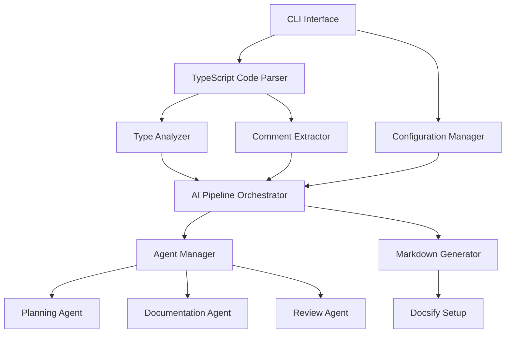

# Hermes – Technical Design Document

## System Overview

Hermes is an AI-powered documentation generator for TypeScript projects that analyzes source code and existing comments to produce comprehensive Markdown documentation. This document details the technical architecture, implementation strategies, and engineering considerations.

## Technical Architecture

### High-Level System Components



### Technology Stack

```mermaid
graph TD
    subgraph "Core Technologies"
        TS[TypeScript] --> Commander[Commander.js]
        TS --> VercelAI[Vercel AI SDK]
        TS --> Biome[Biome]
        TS --> NeverThrow[neverthrow]
        TS --> Zod[zod]
    end

    subgraph "Code Analysis"
        TSMorph[ts-morph] --> CodeParser[Code Parser]
        CommentParser[comment-parser] --> JSDocExtractor[JSDoc Extractor]
    end

    subgraph "Documentation Generation"
        Remark[unified/remark] --> MarkdownParser[remark-parse]
        Remark --> MarkdownGen[remark-stringify]
        Remark --> Frontmatter[remark-frontmatter]
        Remark --> GFM[remark-gfm]
        Remark --> MermaidSupport[remark-mermaid]
    end

    subgraph "AI Orchestration"
        LangChain[LangChain.js] --> AgentWorkflows[Agent Workflows]
        LangChain --> RAG[RAG Capabilities]
        Ollama[Ollama SDK] --> LocalModels[Local Model Support]
    end

    subgraph "File & Config"
        FSPromises[node:fs/promises] --> FSOperations[File System Operations]
        FSExtra[fs-extra] --> ExtendedFS[Extended FS Utilities]
        Cosmiconfig[cosmiconfig] --> ConfigMgmt[Configuration Management]
        Dotenv[dotenv] --> EnvVars[Environment Variables]
    end

    subgraph "CLI Experience"
        Inquirer[inquirer] --> InteractivePrompts[Interactive Prompts]
        PicoColors[picocolors] --> TerminalColoring[Terminal Coloring]
        Ora[ora] --> Spinners[Loading Spinners]
        Boxen[boxen] --> InfoBoxes[Information Boxes]
    end

    subgraph "GitHub Integration"
        Octokit[octokit/rest] --> GitHubAPI[GitHub API]
        SimpleGit[simple-git] --> GitOperations[Git Operations]
    end
```



## Core Component Implementation

### 1. CLI Interface

#### Implementation Details
- **Commander.js**: Command definition and argument parsing
- **Inquirer**: Interactive prompts for configuration collection
- Command structure follows GitLab CLI patterns for familiarity

#### Key Commands
```typescript
import { Command } from 'commander';
import inquirer from 'inquirer';

const program = new Command()
  .name('hermes')
  .description('AI-powered documentation generator for TypeScript')
  .version('0.1.0');

program
  .command('generate')
  .description('Generate documentation from TypeScript code')
  .option('-o, --output <dir>', 'output directory', './docs')
  .option('-d, --detail <level>', 'detail level (low|medium|high)', 'medium')
  .action(async (options) => {
    // Implementation
  });

// Additional commands
```

### 2. Configuration Manager

#### Implementation Details
- **cosmiconfig**: Configuration loading from multiple sources
- **zod**: Schema validation for configuration data
- Supports file, environment variable, and CLI argument sources

#### Configuration Schema
```typescript
import { z } from 'zod';

const ConfigSchema = z.object({
  project: z.object({
    name: z.string(),
    version: z.string().optional(),
    author: z.string().optional(),
  }),
  source: z.object({
    include: z.array(z.string()),
    exclude: z.array(z.string()).optional(),
  }),
  markdown: z.object({
    headingLevel: z.number().min(1).max(6).default(2),
    linkStyle: z.enum(['inline', 'reference']).default('inline'),
  }),
  // Additional configuration properties
});

type ConfigType = z.infer<typeof ConfigSchema>;
```

### 3. TypeScript Code Parser

#### Implementation Details
- **ts-morph**: Type-safe TypeScript Compiler API wrapper
- **comment-parser**: JSDoc comment extraction and normalization
- Implements TypeScript project analysis for code structure discovery

#### Component Design
```typescript
import { Project, SourceFile, ClassDeclaration } from 'ts-morph';
import { Result, ok, err } from 'neverthrow';

class TypeScriptParser {
  private project: Project;

  constructor(tsConfigFilePath?: string) {
    this.project = new Project({
      tsConfigFilePath,
      skipAddingFilesFromTsConfig: true,
    });
  }

  public addSourceFiles(patterns: string[]): Result<void, Error> {
    try {
      this.project.addSourceFilesAtPaths(patterns);
      return ok(undefined);
    } catch (error) {
      return err(error instanceof Error ? error : new Error(String(error)));
    }
  }

  public parseFile(filePath: string): Result<ParsedFile, Error> {
    try {
      const sourceFile = this.project.getSourceFile(filePath);
      if (!sourceFile) {
        return err(new Error(`File not found: ${filePath}`));
      }

      return ok(this.extractFileMetadata(sourceFile));
    } catch (error) {
      return err(error instanceof Error ? error : new Error(String(error)));
    }
  }

  private extractFileMetadata(sourceFile: SourceFile): ParsedFile {
    // Implementation details for extracting classes, interfaces, types, etc.
  }
}
```

### 4. AI Pipeline Orchestrator

#### Implementation Details
- **Vercel AI SDK**: Core AI provider integration
- **LangChain.js**: Structured prompting and agent workflows
- Two processing modes: direct generation and agent-based generation

#### Pipeline Implementation
```typescript
import { VercelAI } from '@vercel/ai';
import { AgentManager } from './agent-manager';
import { Result, ok, err } from 'neverthrow';

class AIPipelineOrchestrator {
  private ai: VercelAI;
  private agentManager: AgentManager;

  constructor(apiKey: string, config: PipelineConfig) {
    this.ai = new VercelAI({ apiKey });
    this.agentManager = new AgentManager(this.ai, config);
  }

  public async generateDocumentation(
    parsedFile: ParsedFile,
    options: GenerationOptions
  ): Promise<Result<GeneratedDoc, Error>> {
    try {
      // Determine if file needs agent-based generation
      if (this.shouldUseAgents(parsedFile, options)) {
        return this.generateWithAgents(parsedFile, options);
      } else {
        return this.generateDirect(parsedFile, options);
      }
    } catch (error) {
      return err(error instanceof Error ? error : new Error(String(error)));
    }
  }

  private shouldUseAgents(parsedFile: ParsedFile, options: GenerationOptions): boolean {
    // Decision logic based on file complexity and configuration
  }

  private async generateDirect(
    parsedFile: ParsedFile,
    options: GenerationOptions
  ): Promise<Result<GeneratedDoc, Error>> {
    // Direct generation implementation
  }

  private async generateWithAgents(
    parsedFile: ParsedFile,
    options: GenerationOptions
  ): Promise<Result<GeneratedDoc, Error>> {
    // Agent-based generation implementation
  }
}
```

### 5. Agent Manager System

#### Implementation Details
- **LangChain.js**: Agent orchestration and workflow management
- Implements specialized agents for different documentation tasks
- Controls agent interactions and token usage optimization

#### Agent Implementation
```typescript
import { LangChain, Agent, Tool } from 'langchain';
import { Result, ok, err } from 'neverthrow';

class AgentManager {
  private langchain: LangChain;
  private agents: Map<string, Agent>;

  constructor(ai: VercelAI, config: AgentConfig) {
    this.langchain = new LangChain({ llm: ai.getLLM() });
    this.agents = new Map();
    this.initializeAgents(config);
  }

  private initializeAgents(config: AgentConfig): void {
    // Initialize planning, documentation, and review agents
    this.agents.set('planning', this.createPlanningAgent(config));
    this.agents.set('documentation', this.createDocumentationAgent(config));
    this.agents.set('review', this.createReviewAgent(config));
  }

  private createPlanningAgent(config: AgentConfig): Agent {
    // Create planning agent implementation
  }

  private createDocumentationAgent(config: AgentConfig): Agent {
    // Create documentation agent implementation
  }

  private createReviewAgent(config: AgentConfig): Agent {
    // Create review agent implementation
  }

  public async executePlanningAgent(
    parsedCode: ParsedFile
  ): Promise<Result<DocumentationPlan, Error>> {
    // Execute planning agent implementation
  }

  // Additional methods for other agents
}
```

## Smart Context Determination System

The Smart Context Determination system optimizes the context provided to AI models by balancing comprehensiveness with token efficiency:

### 1. Symbol Reference Resolution

```typescript
class SymbolReferenceResolver {
  private project: Project;
  private maxDepth: number;
  private referenceCache: Map<string, Set<string>>;

  constructor(project: Project, maxDepth: number = 3) {
    this.project = project;
    this.maxDepth = maxDepth;
    this.referenceCache = new Map();
  }

  public resolveReferences(symbol: Node): Set<string> {
    const symbolId = this.getSymbolId(symbol);

    if (this.referenceCache.has(symbolId)) {
      return this.referenceCache.get(symbolId)!;
    }

    const references = new Set<string>();
    this.collectReferences(symbol, references, 0);

    this.referenceCache.set(symbolId, references);
    return references;
  }

  private collectReferences(symbol: Node, references: Set<string>, depth: number): void {
    if (depth > this.maxDepth) return;

    // Symbol resolution implementation
    // Collects dependencies through imports, heritage clauses, type references, etc.
  }
}
```

### 2. Hierarchical Context Window Construction

```typescript
class ContextWindowBuilder {
  private symbolResolver: SymbolReferenceResolver;

  constructor(symbolResolver: SymbolReferenceResolver) {
    this.symbolResolver = symbolResolver;
  }

  public buildContext(targetSymbol: Node, tokenBudget: number): ContextWindow {
    const context = new ContextWindow(tokenBudget);

    // Primary layer: target component
    const targetCode = this.extractFullSymbolCode(targetSymbol);
    context.addPrimaryLayer(targetCode);

    // Secondary layer: direct dependencies
    const directDependencies = this.getDirectDependencies(targetSymbol);
    context.addSecondaryLayer(directDependencies);

    // Tertiary layer: related components
    const relatedComponents = this.getRelatedComponents(targetSymbol);
    context.addTertiaryLayer(relatedComponents);

    // Boundary layer: summarized ecosystem
    const ecosystemContext = this.generateEcosystemSummary(targetSymbol);
    context.addBoundaryLayer(ecosystemContext);

    return context;
  }

  // Helper methods implementation
}
```

### 3. Semantic Relevance Scoring

```typescript
class SemanticRelevanceScorer {
  private embeddingModel: EmbeddingModel;
  private threshold: number;

  constructor(embeddingModel: EmbeddingModel, threshold: number = 0.7) {
    this.embeddingModel = embeddingModel;
    this.threshold = threshold;
  }

  public async scoreRelevance(
    targetCode: string,
    candidateContextItems: ContextItem[]
  ): Promise<ScoredContextItem[]> {
    const targetEmbedding = await this.embeddingModel.embed(targetCode);

    const scoredItems = await Promise.all(
      candidateContextItems.map(async (item) => {
        const itemEmbedding = await this.embeddingModel.embed(item.code);
        const similarity = this.computeCosineSimilarity(targetEmbedding, itemEmbedding);

        return {
          ...item,
          relevanceScore: similarity,
          isRelevant: similarity >= this.threshold
        };
      })
    );

    return scoredItems
      .filter(item => item.isRelevant)
      .sort((a, b) => b.relevanceScore - a.relevanceScore);
  }

  private computeCosineSimilarity(vec1: number[], vec2: number[]): number {
    // Cosine similarity implementation
  }
}
```

### 4. Token Budget Allocation Algorithm

```typescript
class TokenBudgetAllocator {
  private targetComponentPercentage: number;
  private directDependenciesPercentage: number;
  private usageExamplesPercentage: number;
  private styleGuidePercentage: number;

  constructor(
    targetComponentPercentage: number = 0.4,
    directDependenciesPercentage: number = 0.3,
    usageExamplesPercentage: number = 0.2,
    styleGuidePercentage: number = 0.1
  ) {
    this.targetComponentPercentage = targetComponentPercentage;
    this.directDependenciesPercentage = directDependenciesPercentage;
    this.usageExamplesPercentage = usageExamplesPercentage;
    this.styleGuidePercentage = styleGuidePercentage;
  }

  public allocateBudget(totalTokens: number): TokenBudget {
    return {
      targetComponent: Math.floor(totalTokens * this.targetComponentPercentage),
      directDependencies: Math.floor(totalTokens * this.directDependenciesPercentage),
      usageExamples: Math.floor(totalTokens * this.usageExamplesPercentage),
      styleGuide: Math.floor(totalTokens * this.styleGuidePercentage)
    };
  }

  public applyBudgetConstraints(context: ContextWindow, budget: TokenBudget): void {
    // Implementation for applying budget constraints to context window
    // Uses progressive summarization for components exceeding budget
  }
}
```

## Performance Optimization Strategies

### Token Usage Optimization

```typescript
import NodeCache from 'node-cache';
import pQueue from 'p-queue';

class TokenOptimizer {
  private cache: NodeCache;
  private queue: pQueue;

  constructor(cacheOptions: CacheOptions, queueOptions: QueueOptions) {
    this.cache = new NodeCache(cacheOptions);
    this.queue = new pQueue(queueOptions);
  }

  public async optimizeRequest(
    promptKey: string,
    promptGenerator: () => string,
    executor: (prompt: string) => Promise<string>
  ): Promise<string> {
    // Check cache first
    const cachedResult = this.cache.get<string>(promptKey);
    if (cachedResult) return cachedResult;

    // Queue the request
    return this.queue.add(async () => {
      const prompt = promptGenerator();
      const result = await executor(prompt);

      // Cache the result
      this.cache.set(promptKey, result);

      return result;
    });
  }
}
```

### Code Chunking for Large Files

```typescript
class CodeChunker {
  private maxChunkSize: number;
  private overlapSize: number;

  constructor(maxChunkSize: number = 2000, overlapSize: number = 200) {
    this.maxChunkSize = maxChunkSize;
    this.overlapSize = overlapSize;
  }

  public chunkSourceFile(sourceFile: SourceFile): CodeChunk[] {
    const chunks: CodeChunk[] = [];
    const nodes = this.getTopLevelNodes(sourceFile);

    let currentChunk: Node[] = [];
    let currentSize = 0;

    for (const node of nodes) {
      const nodeSize = this.getNodeSize(node);

      if (currentSize + nodeSize > this.maxChunkSize && currentChunk.length > 0) {
        chunks.push(this.createChunk(currentChunk, sourceFile));
        currentChunk = this.getOverlappingNodes(currentChunk);
        currentSize = this.getTotalSize(currentChunk);
      }

      currentChunk.push(node);
      currentSize += nodeSize;
    }

    if (currentChunk.length > 0) {
      chunks.push(this.createChunk(currentChunk, sourceFile));
    }

    return chunks;
  }

  // Helper method implementations
}
```

## Testing Strategy Implementation

### Unit Testing Setup

```typescript
import { describe, it, expect, beforeEach, vi } from 'vitest';

describe('TypeScriptParser', () => {
  let parser: TypeScriptParser;

  beforeEach(() => {
    parser = new TypeScriptParser();
  });

  it('should parse TypeScript files correctly', () => {
    // Test implementation
  });

  it('should extract JSDoc comments', () => {
    // Test implementation
  });

  // Additional tests
});
```

### Agent Testing Framework

```typescript
class AgentTestFramework {
  private mockAI: MockVercelAI;
  private agentManager: AgentManager;

  constructor() {
    this.mockAI = new MockVercelAI();
    this.agentManager = new AgentManager(this.mockAI, { /* config */ });
  }

  public async testPlanningAgent(input: string, expectedPlan: DocumentationPlan): Promise<boolean> {
    this.mockAI.setResponse('planning', expectedPlan);

    const result = await this.agentManager.executePlanningAgent(this.parseInput(input));

    if (result.isErr()) {
      throw result.error;
    }

    const actualPlan = result.value;
    return this.comparePlans(actualPlan, expectedPlan);
  }

  // Additional test methods
}
```

## Security Implementation

### API Key Management

```typescript
import { config } from 'dotenv';
import { z } from 'zod';

class ApiKeyManager {
  private static instance: ApiKeyManager;
  private apiKeys: Map<string, string>;

  private constructor() {
    config();
    this.apiKeys = new Map();
    this.loadApiKeys();
  }

  public static getInstance(): ApiKeyManager {
    if (!ApiKeyManager.instance) {
      ApiKeyManager.instance = new ApiKeyManager();
    }
    return ApiKeyManager.instance;
  }

  private loadApiKeys(): void {
    const schema = z.object({
      OPENAI_API_KEY: z.string().optional(),
      ANTHROPIC_API_KEY: z.string().optional(),
      // Additional API keys
    });

    const result = schema.safeParse(process.env);

    if (result.success) {
      const { data } = result;
      if (data.OPENAI_API_KEY) this.apiKeys.set('openai', data.OPENAI_API_KEY);
      if (data.ANTHROPIC_API_KEY) this.apiKeys.set('anthropic', data.ANTHROPIC_API_KEY);
      // Additional API keys
    }
  }

  public getApiKey(provider: string): string | undefined {
    return this.apiKeys.get(provider.toLowerCase());
  }
}
```

### Data Transmission Controls

```typescript
enum DataTransmissionLevel {
  FULL = 'full',            // Send all code to AI
  PARTIAL = 'partial',      // Send only necessary context
  MINIMAL = 'minimal',      // Send minimal code, more descriptions
  LOCAL_ONLY = 'local_only' // Use local models only
}

class DataTransmissionController {
  private level: DataTransmissionLevel;
  private sensitivePatterns: RegExp[];

  constructor(level: DataTransmissionLevel, sensitivePatterns: RegExp[] = []) {
    this.level = level;
    this.sensitivePatterns = sensitivePatterns;
  }

  public prepareCodeForTransmission(code: string): string {
    switch (this.level) {
      case DataTransmissionLevel.FULL:
        return this.redactSensitiveData(code);

      case DataTransmissionLevel.PARTIAL:
        return this.redactSensitiveData(this.partialCodeExtraction(code));

      case DataTransmissionLevel.MINIMAL:
        return this.redactSensitiveData(this.minimalCodeExtraction(code));

      case DataTransmissionLevel.LOCAL_ONLY:
        throw new Error('Cannot transmit code with LOCAL_ONLY level');
    }
  }

  private redactSensitiveData(code: string): string {
    let result = code;
    for (const pattern of this.sensitivePatterns) {
      result = result.replace(pattern, '[REDACTED]');
    }
    return result;
  }

  // Additional helper methods
}
```

## Risk Mitigation Implementations

### Agent Loop Prevention

```typescript
class AgentLoopGuard {
  private maxIterations: number;
  private iterationCount: Map<string, number>;

  constructor(maxIterations: number = 5) {
    this.maxIterations = maxIterations;
    this.iterationCount = new Map();
  }

  public checkAndIncrementIteration(agentId: string): Result<void, Error> {
    const currentCount = this.iterationCount.get(agentId) || 0;

    if (currentCount >= this.maxIterations) {
      return err(new Error(`Agent loop detected: ${agentId} exceeded max iterations`));
    }

    this.iterationCount.set(agentId, currentCount + 1);
    return ok(undefined);
  }

  public resetIterations(agentId: string): void {
    this.iterationCount.set(agentId, 0);
  }
}
```

### Cost Control System

```typescript
interface CostLimits {
  perRun: number;
  monthly: number;
}

class CostController {
  private limits: CostLimits;
  private currentRunCost: number;
  private monthlyUsage: number;
  private modelCosts: Map<string, number>;

  constructor(limits: CostLimits) {
    this.limits = limits;
    this.currentRunCost = 0;
    this.monthlyUsage = this.loadMonthlyUsage();
    this.modelCosts = this.initializeModelCosts();
  }

  public estimateCost(model: string, tokens: number): number {
    const costPerToken = this.modelCosts.get(model) || 0;
    return tokens * costPerToken;
  }

  public trackUsage(model: string, inputTokens: number, outputTokens: number): Result<void, Error> {
    const inputCost = this.estimateCost(model, inputTokens);
    const outputCost = this.estimateCost(model, outputTokens);
    const totalCost = inputCost + outputCost;

    this.currentRunCost += totalCost;
    this.monthlyUsage += totalCost;

    // Save updated monthly usage
    this.saveMonthlyUsage();

    // Check against limits
    if (this.currentRunCost > this.limits.perRun) {
      return err(new Error('Per-run cost limit exceeded'));
    }

    if (this.monthlyUsage > this.limits.monthly) {
      return err(new Error('Monthly cost limit exceeded'));
    }

    return ok(undefined);
  }

  // Helper methods
}
```

## Configuration Implementation Examples

### Hermes Configuration File (hermes.config.js)

```javascript
/** @type {import('hermes-docgen').HermesConfig} */
module.exports = {
  project: {
    name: 'MyTypeScriptProject',
    version: '1.0.0',
    author: 'Development Team',
  },
  source: {
    include: ['src/**/*.ts', 'src/**/*.tsx'],
    exclude: ['**/*.spec.ts', '**/*.test.ts', 'dist/**'],
  },
  markdown: {
    headingLevel: 2,
    linkStyle: 'inline',
    codeBlocks: {
      typescript: true,
      lineNumbers: true,
    },
  },
  docsify: {
    theme: 'vue',
    plugins: ['search', 'copy-code'],
    logo: 'logo.png',
  },
  ai: {
    model: 'gpt-4',
    temperature: 0.2,
    provider: 'openai',
    fallbackProvider: 'anthropic',
  },
  agents: {
    mode: 'balanced',
    planning: true,
    documentation: true,
    review: true,
  },
  context: {
    dependencyDepth: 3,
    relevanceThreshold: 0.7,
    tokenBudget: {
      targetComponent: 0.4,
      directDependencies: 0.3,
      usageExamples: 0.2,
      styleGuide: 0.1,
    },
  },
  diataxis: {
    tutorials: 'docs/tutorials',
    howTo: 'docs/how-to',
    reference: 'docs/reference',
    explanation: 'docs/explanation',
  },
};
```

### GitHub Action Workflow Implementation

```yaml
name: Generate Documentation

on:
  push:
    branches:
      - main
  pull_request:
    types: [opened, synchronize]
    paths:
      - 'src/**/*.ts'
      - 'src/**/*.tsx'

jobs:
  docs:
    runs-on: ubuntu-latest
    steps:
      - name: Checkout repository
        uses: actions/checkout@v3
        with:
          fetch-depth: 0

      - name: Setup Node.js
        uses: actions/setup-node@v3
        with:
          node-version: '18.x'
          cache: 'npm'

      - name: Install dependencies
        run: npm ci

      - name: Generate documentation
        run: npx hermes generate
        env:
          OPENAI_API_KEY: ${{ secrets.OPENAI_API_KEY }}

      - name: Setup Docsify
        run: npx hermes setup-docsify

      - name: Deploy to GitHub Pages
        if: github.event_name == 'push' && github.ref == 'refs/heads/main'
        uses: peaceiris/actions-gh-pages@v3
        with:
          github_token: ${{ secrets.GITHUB_TOKEN }}
          publish_dir: ./docs
```

## Implementation Timeline

### Phase 1: Core Framework (2 Months)
- CLI interface with Commander.js
- Basic TypeScript parsing with ts-morph
- Initial AI integration with Vercel AI SDK
- Simple Markdown generation

### Phase 2: Agent System Development (3 Months)
- LangChain.js integration
- Agent manager implementation
- Smart context determination system
- Docsify integration

### Phase 3: Optimization & Testing (2 Months)
- Token optimization
- Performance enhancements
- Testing framework
- CI/CD integration

### Phase 4: Release & Refinement (Ongoing)
- User feedback collection
- Agent behavior refinement
- Context system tuning
- Advanced feature implementation

## Conclusion

This technical design document outlines the detailed implementation strategy for Hermes, an AI-powered documentation generator for TypeScript projects. The architecture leverages modern tools and technologies, with a focus on code quality, security, and performance optimization. The modular design allows for flexible deployment options, scalability, and adaptability to changing AI capabilities and user requirements.
