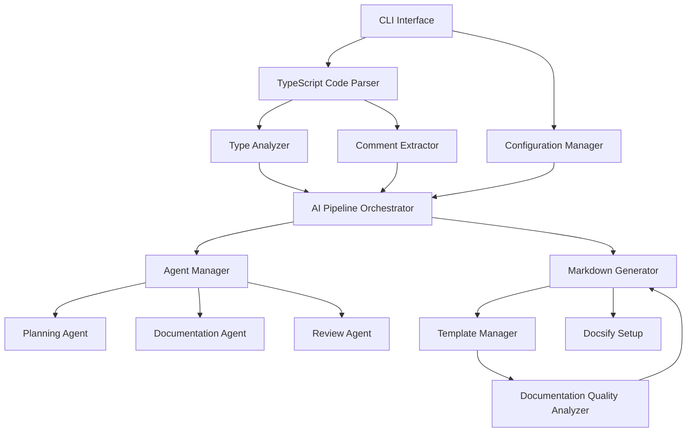

# Hermes – Technical Design Document

## System Overview

Hermes is an AI-powered documentation generator for TypeScript projects that analyzes source code and existing comments to produce comprehensive Markdown documentation. This document details the technical architecture, implementation strategies, and engineering considerations.

## Technical Architecture

### High-Level System Components



### Technology Stack

```mermaid
graph TD
    subgraph "Core Technologies"
        TS[TypeScript] --> Commander[Commander.js]
        TS --> VercelAI[Vercel AI SDK]
        TS --> Biome[Biome]
        TS --> NeverThrow[neverthrow]
        TS --> Zod[zod]
    end

    subgraph "Code Analysis"
        TSMorph[ts-morph] --> CodeParser[Code Parser]
        CommentParser[comment-parser] --> JSDocExtractor[JSDoc Extractor]
    end

    subgraph "Documentation Generation"
        Remark[unified/remark] --> MarkdownParser[remark-parse]
        Remark --> MarkdownGen[remark-stringify]
        Remark --> Frontmatter[remark-frontmatter]
        Remark --> GFM[remark-gfm]
        Remark --> MermaidSupport[remark-mermaid]
        Handlebars[Handlebars] --> TemplateSystem[Template System]
    end

    subgraph "AI Orchestration"
        AICore[AI SDK Core] --> AnthrSdk[@ai-sdk/anthropic]
        AICore --> OpenAISdk[@ai-sdk/openai]
        AICore --> GoogleSdk[@ai-sdk/google]
        LangChain[LangChain.js] --> AgentWorkflows[Agent Workflows]
        LangChain --> RAG[RAG Capabilities]
        Ollama[Ollama SDK] --> LocalModels[Local Model Support]
    end

    subgraph "File & Config"
        FSPromises[node:fs/promises] --> FSOperations[File System Operations]
        FSExtra[fs-extra] --> ExtendedFS[Extended FS Utilities]
        Cosmiconfig[cosmiconfig] --> ConfigMgmt[Configuration Management]
        Dotenv[dotenv] --> EnvVars[Environment Variables]
    end

    subgraph "CLI Experience"
        Inquirer[inquirer] --> InteractivePrompts[Interactive Prompts]
        PicoColors[picocolors] --> TerminalColoring[Terminal Coloring]
        Ora[ora] --> Spinners[Loading Spinners]
        Boxen[boxen] --> InfoBoxes[Information Boxes]
    end

    subgraph "Performance Optimization"
        Lodash[lodash] --> BatchProcessing[Batch Processing]
        Lodash --> ThrottleRequests[Request Throttling]
        NodeCache[node-cache] --> ResponseCaching[Response Caching]
        PQueue[p-queue] --> ConcurrencyControl[Concurrency Control]
    end

    subgraph "GitHub Integration"
        Octokit[octokit/rest] --> GitHubAPI[GitHub API]
        SimpleGit[simple-git] --> GitOperations[Git Operations]
    end
```

## Core Component Implementation

### 1. CLI Interface

#### Implementation Details
- **Commander.js**: Command definition and argument parsing
- **Inquirer**: Interactive prompts for configuration collection
- Command structure follows GitLab CLI patterns for familiarity

#### Key Commands
```typescript
import { Command } from 'commander';
import inquirer from 'inquirer';

const program = new Command()
  .name('hermes')
  .description('AI-powered documentation generator for TypeScript')
  .version('0.1.0');

program
  .command('generate')
  .description('Generate documentation from TypeScript code')
  .option('-o, --output <dir>', 'output directory', './docs')
  .option('-d, --detail <level>', 'detail level (low|medium|high)', 'medium')
  .option('-p, --provider <provider>', 'AI provider (anthropic|openai|google)', 'anthropic')
  .action(async (options) => {
    // Implementation
  });

program
  .command('setup-docsify')
  .description('Set up Docsify for documentation viewing')
  .option('-t, --theme <theme>', 'docsify theme', 'vue')
  .action(async (options) => {
    // Implementation
  });

program
  .command('verify')
  .description('Verify documentation quality')
  .option('-t, --threshold <number>', 'quality threshold (0-100)', '80')
  .action(async (options) => {
    // Implementation
  });

// Additional commands
```

### 2. Configuration Manager

#### Implementation Details
- **cosmiconfig**: Configuration loading from multiple sources
- **zod**: Schema validation for configuration data
- **dotenv**: Environment variable management for API keys
- Supports file, environment variable, and CLI argument sources

#### Configuration Schema
```typescript
import { z } from 'zod';
import { cosmiconfig } from 'cosmiconfig';
import dotenv from 'dotenv';

// Load environment variables
dotenv.config();

// Define configuration schema with Zod
const ConfigSchema = z.object({
  project: z.object({
    name: z.string(),
    version: z.string().optional(),
    author: z.string().optional(),
  }),
  source: z.object({
    include: z.array(z.string()),
    exclude: z.array(z.string()).optional().default([]),
  }),
  markdown: z.object({
    headingLevel: z.number().min(1).max(6).default(2),
    linkStyle: z.enum(['inline', 'reference']).default('inline'),
    codeBlocks: z.object({
      typescript: z.boolean().default(true),
      lineNumbers: z.boolean().default(true),
    }).optional().default({}),
  }),
  ai: z.object({
    provider: z.enum(['anthropic', 'openai', 'google']).default('anthropic'),
    model: z.string().optional(),
    temperature: z.number().min(0).max(1).default(0.2),
    fallbackProvider: z.enum(['anthropic', 'openai', 'google']).optional(),
    maxTokens: z.number().optional().default(4000),
    thinkingBudget: z.number().optional(),
  }),
  agents: z.object({
    mode: z.enum(['minimal', 'balanced', 'extensive']).default('balanced'),
    planning: z.boolean().default(true),
    documentation: z.boolean().default(true),
    review: z.boolean().default(true),
  }),
  context: z.object({
    dependencyDepth: z.number().min(0).max(5).default(3),
    relevanceThreshold: z.number().min(0).max(1).default(0.7),
    tokenBudget: z.object({
      targetComponent: z.number().default(0.4),
      directDependencies: z.number().default(0.3),
      usageExamples: z.number().default(0.2),
      styleGuide: z.number().default(0.1),
    }).optional().default({}),
  }).optional().default({}),
  templates: z.record(z.string()).optional(),
  security: z.object({
    dataTransmissionLevel: z.enum(['full', 'partial', 'minimal', 'local_only']).default('partial'),
    sensitivePatterns: z.array(z.string()).optional().default([]),
  }).optional().default({}),
  cost: z.object({
    perRunLimit: z.number().optional(),
    monthlyLimit: z.number().optional(),
  }).optional().default({}),
});

type ConfigType = z.infer<typeof ConfigSchema>;

export class ConfigurationManager {
  private explorer = cosmiconfig('hermes');
  private config: ConfigType | null = null;

  async loadConfig(configPath?: string): Promise<Result<ConfigType, Error>> {
    try {
      // Search for configuration or load from specific path
      const result = configPath
        ? await this.explorer.load(configPath)
        : await this.explorer.search();

      if (result === null) {
        return this.getDefaultConfig();
      }

      // Validate configuration
      const validationResult = ConfigSchema.safeParse(result.config);

      if (validationResult.success) {
        this.config = validationResult.data;
        return ok(this.config);
      } else {
        return err(new Error(`Invalid configuration: ${validationResult.error.message}`));
      }
    } catch (error) {
      return err(error instanceof Error ? error : new Error(String(error)));
    }
  }

  // Additional methods for configuration management
}
```

### 3. TypeScript Code Parser

#### Implementation Details
- **ts-morph**: Type-safe TypeScript Compiler API wrapper
- **comment-parser**: JSDoc comment extraction and normalization
- Implements TypeScript project analysis for code structure discovery

#### Component Design
```typescript
import { Project, SourceFile, ClassDeclaration } from 'ts-morph';
import { Result, ok, err } from 'neverthrow';
import { parse as parseComment } from 'comment-parser';

class TypeScriptParser {
  private project: Project;

  constructor(tsConfigFilePath?: string) {
    this.project = new Project({
      tsConfigFilePath,
      skipAddingFilesFromTsConfig: true,
    });
  }

  public addSourceFiles(patterns: string[]): Result<void, Error> {
    try {
      this.project.addSourceFilesAtPaths(patterns);
      return ok(undefined);
    } catch (error) {
      return err(error instanceof Error ? error : new Error(String(error)));
    }
  }

  public parseFile(filePath: string): Result<ParsedFile, Error> {
    try {
      const sourceFile = this.project.getSourceFile(filePath);
      if (!sourceFile) {
        return err(new Error(`File not found: ${filePath}`));
      }

      return ok(this.extractFileMetadata(sourceFile));
    } catch (error) {
      return err(error instanceof Error ? error : new Error(String(error)));
    }
  }

  private extractFileMetadata(sourceFile: SourceFile): ParsedFile {
    // Extract classes, interfaces, functions, etc.
    const classes = this.extractClasses(sourceFile);
    const interfaces = this.extractInterfaces(sourceFile);
    const types = this.extractTypes(sourceFile);
    const functions = this.extractFunctions(sourceFile);

    return {
      filePath: sourceFile.getFilePath(),
      classes,
      interfaces,
      types,
      functions,
      exports: this.extractExports(sourceFile),
      imports: this.extractImports(sourceFile),
    };
  }

  private extractClasses(sourceFile: SourceFile): ParsedClass[] {
    return sourceFile.getClasses().map(classDecl => {
      const name = classDecl.getName() || 'AnonymousClass';
      const jsDocs = this.extractJSDoc(classDecl);

      return {
        name,
        description: jsDocs.description || '',
        properties: this.extractProperties(classDecl),
        methods: this.extractMethods(classDecl),
        decorators: this.extractDecorators(classDecl),
        isExported: classDecl.isExported(),
        heritage: this.extractHeritage(classDecl),
        location: this.getNodeLocation(classDecl),
        jsDocs,
      };
    });
  }

  // Additional methods for extracting interfaces, types, functions, etc.

  private extractJSDoc(node: Node): JSDocInfo {
    const jsDocNodes = node.getJsDocs();
    if (jsDocNodes.length === 0) {
      return { description: '', tags: [] };
    }

    const jsDoc = jsDocNodes[0];
    const commentText = jsDoc.getComment() || '';

    // Use comment-parser to parse JSDoc content
    const parsedDocs = parseComment(`/*${jsDoc.getText()}*/`);
    const description = parsedDocs[0]?.description || '';
    const tags = parsedDocs[0]?.tags.map(tag => ({
      tag: tag.tag,
      name: tag.name,
      description: tag.description,
    })) || [];

    return { description, tags };
  }
}
```

### 4. AI Pipeline Orchestrator

#### Implementation Details
- **AI SDK Core**: Foundation for AI provider integration
- **@ai-sdk/anthropic**: Claude model integration with thinking mode
- **@ai-sdk/openai**: GPT model integration
- **@ai-sdk/google**: Gemini model integration
- **LangChain.js**: Structured prompting and agent workflows
- Multiple AI providers with fallback mechanism

#### Pipeline Implementation
```typescript
import { Result, ok, err, ResultAsync } from 'neverthrow';
import { streamText, generateText } from '@ai-sdk/core';
import { anthropic } from '@ai-sdk/anthropic';
import { openai } from '@ai-sdk/openai';
import { google } from '@ai-sdk/google';

class AIProviderManager {
  private provider: string;
  private apiKey: string;

  constructor(provider: string, apiKey: string) {
    this.provider = provider;
    this.apiKey = apiKey;
  }

  async generateDocumentation(
    code: string,
    context: string,
    options: GenerationOptions
  ): Promise<Result<string, Error>> {
    try {
      const messages = [
        { role: 'system', content: 'Generate clear, comprehensive documentation for the provided TypeScript code.' },
        { role: 'user', content: `Code:\n${code}\n\nContext:\n${context}` }
      ];

      switch (this.provider.toLowerCase()) {
        case 'anthropic':
          return await this.useAnthropic(messages, options);
        case 'openai':
          return await this.useOpenAI(messages, options);
        case 'google':
          return await this.useGoogle(messages, options);
        default:
          return err(new Error(`Unsupported AI provider: ${this.provider}`));
      }
    } catch (error) {
      return err(error instanceof Error ? error : new Error(String(error)));
    }
  }

  private async useAnthropic(messages: any[], options: GenerationOptions): Promise<Result<string, Error>> {
    try {
      const { text } = await streamText({
        model: anthropic('claude-3-7-sonnet-20250219'),
        messages,
        providerOptions: {
          anthropic: {
            thinking: {
              type: 'enabled',
              budgetTokens: options.thinkingBudget || 12000
            },
          },
        },
      });

      return ok(text);
    } catch (error) {
      return err(error instanceof Error ? error : new Error(String(error)));
    }
  }

  // Additional methods for other providers
}

class AIPipelineOrchestrator {
  private aiProviderManager: AIProviderManager;
  private agentManager: AgentManager;
  private config: PipelineConfig;

  constructor(config: PipelineConfig) {
    this.config = config;
    this.aiProviderManager = new AIProviderManager(
      config.aiProvider,
      this.getApiKey(config.aiProvider)
    );
    this.agentManager = new AgentManager(this.aiProviderManager, config);
  }

  public async generateDocumentation(
    parsedFile: ParsedFile,
    options: GenerationOptions
  ): Promise<Result<GeneratedDoc, Error>> {
    try {
      // Determine if file needs agent-based generation
      if (this.shouldUseAgents(parsedFile, options)) {
        return this.generateWithAgents(parsedFile, options);
      } else {
        return this.generateDirect(parsedFile, options);
      }
    } catch (error) {
      return err(error instanceof Error ? error : new Error(String(error)));
    }
  }

  private shouldUseAgents(parsedFile: ParsedFile, options: GenerationOptions): boolean {
    // Decision logic based on file complexity and configuration
    const complexityScore = this.calculateComplexity(parsedFile);
    const configMode = this.config.agents.mode;

    if (configMode === 'extensive') return true;
    if (configMode === 'minimal') return false;

    // For 'balanced' mode, make decision based on complexity
    return complexityScore > 50; // Threshold for using agents
  }

  private async generateDirect(
    parsedFile: ParsedFile,
    options: GenerationOptions
  ): Promise<Result<GeneratedDoc, Error>> {
    // Extract code and context
    const { code, context } = this.prepareCodeAndContext(parsedFile);

    // Generate documentation using AI provider
    const result = await this.aiProviderManager.generateDocumentation(
      code,
      context,
      options
    );

    if (result.isErr()) {
      // Try fallback provider if configured
      if (this.config.ai.fallbackProvider) {
        const fallbackManager = new AIProviderManager(
          this.config.ai.fallbackProvider,
          this.getApiKey(this.config.ai.fallbackProvider)
        );

        return fallbackManager.generateDocumentation(code, context, options)
          .andThen(docText => this.parseGeneratedDocumentation(docText, parsedFile));
      }

      return err(result.error);
    }

    return this.parseGeneratedDocumentation(result.value, parsedFile);
  }

  private async generateWithAgents(
    parsedFile: ParsedFile,
    options: GenerationOptions
  ): Promise<Result<GeneratedDoc, Error>> {
    // Planning phase
    const planResult = await this.agentManager.executePlanningAgent(parsedFile);

    if (planResult.isErr()) {
      return err(planResult.error);
    }

    const plan = planResult.value;

    // Documentation generation phase
    const docResult = await this.agentManager.executeDocumentationAgent(parsedFile, plan);

    if (docResult.isErr()) {
      return err(docResult.error);
    }

    // Review phase
    const reviewResult = await this.agentManager.executeReviewAgent(docResult.value);

    if (reviewResult.isErr()) {
      return err(reviewResult.error);
    }

    return ok(reviewResult.value);
  }

  // Helper methods for context preparation, API key management, etc.
}
```

### 5. Agent Manager System

#### Implementation Details
- **LangChain.js**: Agent orchestration and workflow management
- Implements specialized agents for different documentation tasks
- Controls agent interactions and token usage optimization

#### Agent Implementation
```typescript
import { LangChain, Agent, Tool } from 'langchain';
import { Result, ok, err } from 'neverthrow';

class AgentManager {
  private aiProvider: AIProviderManager;
  private agents: Map<string, Agent>;
  private config: AgentConfig;
  private loopGuard: AgentLoopGuard;

  constructor(aiProvider: AIProviderManager, config: AgentConfig) {
    this.aiProvider = aiProvider;
    this.config = config;
    this.agents = new Map();
    this.loopGuard = new AgentLoopGuard(5); // Max 5 iterations
    this.initializeAgents();
  }

  private initializeAgents(): void {
    // Initialize planning, documentation, and review agents
    this.agents.set('planning', this.createPlanningAgent());
    this.agents.set('documentation', this.createDocumentationAgent());
    this.agents.set('review', this.createReviewAgent());
  }

  private createPlanningAgent(): Agent {
    // Create planning agent with tools and prompt templates
    const tools = [
      new Tool({
        name: 'analyze-type-structure',
        description: 'Analyze TypeScript type structure',
        func: async (input: string) => {
          // Implementation
        }
      }),
      new Tool({
        name: 'search-related-code',
        description: 'Search for related code in the codebase',
        func: async (input: string) => {
          // Implementation
        }
      }),
      new Tool({
        name: 'extract-examples',
        description: 'Extract usage examples from codebase',
        func: async (input: string) => {
          // Implementation
        }
      })
    ];

    return new Agent({
      tools,
      llm: this.aiProvider,
      prompt: PLANNING_AGENT_PROMPT
    });
  }

  // Methods for other agent types

  public async executePlanningAgent(
    parsedCode: ParsedFile
  ): Promise<Result<DocumentationPlan, Error>> {
    // Reset iteration counter
    this.loopGuard.resetIterations('planning');

    try {
      const agent = this.agents.get('planning');
      if (!agent) {
        return err(new Error('Planning agent not initialized'));
      }

      // Check iteration limit
      const loopCheck = this.loopGuard.checkAndIncrementIteration('planning');
      if (loopCheck.isErr()) {
        return err(loopCheck.error);
      }

      // Execute agent
      const result = await agent.execute({
        input: JSON.stringify(parsedCode),
        maxIterations: 5
      });

      // Parse and validate the plan
      try {
        const plan = JSON.parse(result.output);
        return ok(plan);
      } catch (error) {
        return err(new Error(`Failed to parse planning agent output: ${error}`));
      }
    } catch (error) {
      return err(error instanceof Error ? error : new Error(String(error)));
    }
  }

  // Additional methods for other agents
}

class AgentLoopGuard {
  private maxIterations: number;
  private iterationCount: Map<string, number>;

  constructor(maxIterations: number = 5) {
    this.maxIterations = maxIterations;
    this.iterationCount = new Map();
  }

  public checkAndIncrementIteration(agentId: string): Result<void, Error> {
    const currentCount = this.iterationCount.get(agentId) || 0;

    if (currentCount >= this.maxIterations) {
      return err(new Error(`Agent loop detected: ${agentId} exceeded max iterations`));
    }

    this.iterationCount.set(agentId, currentCount + 1);
    return ok(undefined);
  }

  public resetIterations(agentId: string): void {
    this.iterationCount.set(agentId, 0);
  }
}
```

### 6. Template Manager

#### Implementation Details
- **Handlebars**: Templating engine for documentation generation
- Customizable templates for different documentation components
- Support for user-defined templates and custom formatters

#### Implementation
```typescript
import { Result, ok, err } from 'neverthrow';
import Handlebars from 'handlebars';
import fs from 'fs/promises';
import path from 'path';

// Default templates
const DEFAULT_TEMPLATES = {
  class: `
# {{className}}

{{classDescription}}

## Properties

{{#each properties}}
### {{name}}

- **Type**: \`{{type}}\`
- **Description**: {{description}}
{{/each}}

## Methods

{{#each methods}}
### {{name}}

{{description}}

{{#if parameters.length}}
**Parameters**:
{{#each parameters}}
- \`{{name}}\`: \`{{type}}\` - {{description}}
{{/each}}
{{/if}}

**Returns**: \`{{returnType}}\` - {{returnDescription}}
{{/each}}
`,
  // Additional templates for other code elements
};

export class TemplateManager {
  private templates: Record<string, HandlebarsTemplateDelegate> = {};
  private customTemplateDir?: string;

  constructor(customTemplateDir?: string, customTemplates?: Record<string, string>) {
    this.customTemplateDir = customTemplateDir;
    this.registerDefaultTemplates();

    if (customTemplates) {
      this.registerCustomTemplatesFromObject(customTemplates);
    }
  }

  async initialize(): Promise<Result<void, Error>> {
    try {
      if (this.customTemplateDir) {
        const result = await this.loadCustomTemplatesFromDirectory(this.customTemplateDir);
        if (result.isErr()) {
          return result;
        }
      }

      this.registerHelpers();
      return ok(undefined);
    } catch (error) {
      return err(error instanceof Error ? error : new Error(String(error)));
    }
  }

  private registerDefaultTemplates(): void {
    for (const [name, templateString] of Object.entries(DEFAULT_TEMPLATES)) {
      this.templates[name] = Handlebars.compile(templateString);
    }
  }

  // Methods for template registration, loading, and rendering

  private registerHelpers(): void {
    Handlebars.registerHelper('formatType', function(type: string) {
      // Format complex TypeScript types for better readability
      return type.replace(/\|/g, ' | ').replace(/&/g, ' & ');
    });

    Handlebars.registerHelper('codeBlock', function(content: string, language: string) {
      return `\`\`\`${language}\n${content}\n\`\`\``;
    });

    // Additional helpers
  }

  renderTemplate(type: string, data: any): Result<string, Error> {
    const templateResult = this.getTemplate(type);

    if (templateResult.isErr()) {
      return err(templateResult.error);
    }

    try {
      const template = templateResult.value;
      const rendered = template(data);
      return ok(rendered);
    } catch (error) {
      return err(error instanceof Error ? error : new Error(`Template rendering failed: ${error}`));
    }
  }
}
```

### 7. Batch Processing System

#### Implementation Details
- **lodash**: Utilities for chunking and throttling
- **p-queue**: Concurrency control for API requests
- **node-cache**: Caching for API responses
- Implements incremental processing for large codebases

#### Implementation
```typescript
import { Result, ok, err, ResultAsync } from 'neverthrow';
import { throttle, chunk } from 'lodash';
import path from 'path';
import fs from 'fs/promises';
import PQueue from 'p-queue';
import NodeCache from 'node-cache';

interface ProcessingStats {
  totalFiles: number;
  processedFiles: number;
  skippedFiles: number;
  errorFiles: number;
  startTime: Date;
  endTime?: Date;
  elapsedMs?: number;
}

export class BatchProcessor {
  private codeParser: CodeParser;
  private aiPipeline: AIPipelineOrchestrator;
  private markdownGenerator: MarkdownGenerator;
  private batchSize: number;
  private concurrency: number;
  private delayBetweenBatches: number;
  private outputDir: string;
  private stats: ProcessingStats;
  private cache: NodeCache;
  private queue: PQueue;
  private onProgressCallback?: (stats: ProcessingStats) => void;

  constructor(
    codeParser: CodeParser,
    aiPipeline: AIPipelineOrchestrator,
    markdownGenerator: MarkdownGenerator,
    options: {
      batchSize?: number;
      concurrency?: number;
      delayBetweenBatches?: number;
      outputDir: string;
      onProgress?: (stats: ProcessingStats) => void;
    }
  ) {
    this.codeParser = codeParser;
    this.aiPipeline = aiPipeline;
    this.markdownGenerator = markdownGenerator;
    this.batchSize = options.batchSize || 5;
    this.concurrency = options.concurrency || 2;
    this.delayBetweenBatches = options.delayBetweenBatches || 1000;
    this.outputDir = options.outputDir;
    this.onProgressCallback = options.onProgress;

    this.stats = {
      totalFiles: 0,
      processedFiles: 0,
      skippedFiles: 0,
      errorFiles: 0,
      startTime: new Date(),
    };

    this.cache = new NodeCache({ stdTTL: 3600, checkperiod: 600 });
    this.queue = new PQueue({ concurrency: this.concurrency });
  }

  async processFiles(files: string[]): Promise<Result<ProcessingStats, Error>> {
    try {
      this.stats.totalFiles = files.length;
      this.stats.startTime = new Date();

      // Create output directory if it doesn't exist
      await fs.mkdir(this.outputDir, { recursive: true });

      // Split files into batches
      const batches = chunk(files, this.batchSize);

      for (let i = 0; i < batches.length; i++) {
        const batch = batches[i];
        console.log(`Processing batch ${i + 1} of ${batches.length} (${batch.length} files)`);

        // Process batch with controlled concurrency
        const results = await this.processBatch(batch);

        // Update statistics
        results.forEach(result => {
          if (result.isOk()) {
            this.stats.processedFiles++;
          } else if (result.error.message.includes('Skipped')) {
            this.stats.skippedFiles++;
          } else {
            this.stats.errorFiles++;
          }
        });

        // Call progress callback if provided
        if (this.onProgressCallback) {
          this.onProgressCallback({ ...this.stats });
        }

        // Add delay between batches to avoid rate limiting
        if (i < batches.length - 1) {
          await new Promise(resolve => setTimeout(resolve, this.delayBetweenBatches));
        }
      }

      // Update final statistics
      this.stats.endTime = new Date();
      this.stats.elapsedMs = this.stats.endTime.getTime() - this.stats.startTime.getTime();

      return ok(this.stats);
    } catch (error) {
      return err(error instanceof Error ? error : new Error(String(error)));
    }
  }

  // Additional implementation details
}
```

### 8. Documentation Quality Analyzer

#### Implementation Details
- Analyzes documentation for clarity, completeness, and consistency
- Implements best practices from documentation guidelines
- Provides recommendations for improvement

#### Implementation
```typescript
class DocumentationQualityAnalyzer {
  private qualityThreshold: number;
  private aiPipeline: AIPipelineOrchestrator;

  constructor(aiPipeline: AIPipelineOrchestrator, qualityThreshold: number = 80) {
    this.aiPipeline = aiPipeline;
    this.qualityThreshold = qualityThreshold;
  }

  async analyzeDocumentation(documentation: string): Promise<Result<QualityReport, Error>> {
    try {
      const clarityScore = this.analyzeClarityMetrics(documentation);
      const completenessScore = this.analyzeCompletenessMetrics(documentation);
      const consistencyScore = this.analyzeConsistencyMetrics(documentation);
      const examplesScore = this.analyzeExamplesMetrics(documentation);
      const organizationScore = this.analyzeOrganizationMetrics(documentation);

      const totalScore = (
        clarityScore.score * 0.3 +
        completenessScore.score * 0.3 +
        consistencyScore.score * 0.15 +
        examplesScore.score * 0.15 +
        organizationScore.score * 0.1
      );

      const improvements: Improvement[] = [];

      // Collect improvement suggestions from each metric
      if (clarityScore.score < this.qualityThreshold) {
        improvements.push(...clarityScore.improvements);
      }

      if (completenessScore.score < this.qualityThreshold) {
        improvements.push(...completenessScore.improvements);
      }

      if (consistencyScore.score < this.qualityThreshold) {
        improvements.push(...consistencyScore.improvements);
      }

      if (examplesScore.score < this.qualityThreshold) {
        improvements.push(...examplesScore.improvements);
      }

      if (organizationScore.score < this.qualityThreshold) {
        improvements.push(...organizationScore.improvements);
      }

      const report: QualityReport = {
        overallScore: totalScore,
        metrics: {
          clarity: clarityScore,
          completeness: completenessScore,
          consistency: consistencyScore,
          examples: examplesScore,
          organization: organizationScore,
        },
        passesThreshold: totalScore >= this.qualityThreshold,
        improvements,
      };

      return ok(report);
    } catch (error) {
      return err(error instanceof Error ? error : new Error(String(error)));
    }
  }

  async improveDocumentation(documentation: string, qualityReport: QualityReport): Promise<Result<string, Error>> {
    if (qualityReport.passesThreshold) {
      return ok(documentation);
    }

    try {
      // Generate improvement prompts based on quality report
      const improvementPrompts = this.generateImprovementPrompts(qualityReport);

      // Use AI to improve documentation
      let improvedDoc = documentation;

      for (const prompt of improvementPrompts) {
        const result = await this.aiPipeline.generateImprovement(improvedDoc, prompt);

        if (result.isOk()) {
          improvedDoc = result.value;
        }
      }

      return ok(improvedDoc);
    } catch (error) {
      return err(error instanceof Error ? error : new Error(String(error)));
    }
  }

  // Implementation of analysis metrics
  private analyzeClarityMetrics(documentation: string): MetricResult {
    // Implement clarity analysis based on documentation guidelines
    // Check for jargon, sentence complexity, readability scores

    // Placeholder implementation
    return {
      score: 0,
      details: {},
      improvements: [],
    };
  }

  // Additional metric implementations
}
```

## Smart Context Determination System

The Smart Context Determination system optimizes the context provided to AI models by balancing comprehensiveness with token efficiency:

### 1. Symbol Reference Resolution

```typescript
class SymbolReferenceResolver {
  private project: Project;
  private maxDepth: number;
  private referenceCache: Map<string, Set<string>>;

  constructor(project: Project, maxDepth: number = 3) {
    this.project = project;
    this.maxDepth = maxDepth;
    this.referenceCache = new Map();
  }

  public resolveReferences(symbol: Node): Set<string> {
    const symbolId = this.getSymbolId(symbol);

    if (this.referenceCache.has(symbolId)) {
      return this.referenceCache.get(symbolId)!;
    }

    const references = new Set<string>();
    this.collectReferences(symbol, references, 0);

    this.referenceCache.set(symbolId, references);
    return references;
  }

  private collectReferences(symbol: Node, references: Set<string>, depth: number): void {
    if (depth > this.maxDepth) return;

    // Symbol resolution implementation
    // Collects dependencies through imports, heritage clauses, type references, etc.
  }
}
```

### 2. Hierarchical Context Window Construction

```typescript
class ContextWindowBuilder {
  private symbolResolver: SymbolReferenceResolver;

  constructor(symbolResolver: SymbolReferenceResolver) {
    this.symbolResolver = symbolResolver;
  }

  public buildContext(targetSymbol: Node, tokenBudget: number): ContextWindow {
    const context = new ContextWindow(tokenBudget);

    // Primary layer: target component
    const targetCode = this.extractFullSymbolCode(targetSymbol);
    context.addPrimaryLayer(targetCode);

    // Secondary layer: direct dependencies
    const directDependencies = this.getDirectDependencies(targetSymbol);
    context.addSecondaryLayer(directDependencies);

    // Tertiary layer: related components
    const relatedComponents = this.getRelatedComponents(targetSymbol);
    context.addTertiaryLayer(relatedComponents);

    // Boundary layer: summarized ecosystem
    const ecosystemContext = this.generateEcosystemSummary(targetSymbol);
    context.addBoundaryLayer(ecosystemContext);

    return context;
  }

  // Helper methods implementation
}
```

### 3. Semantic Relevance Scoring

```typescript
class SemanticRelevanceScorer {
  private embeddingModel: EmbeddingModel;
  private threshold: number;

  constructor(embeddingModel: EmbeddingModel, threshold: number = 0.7) {
    this.embeddingModel = embeddingModel;
    this.threshold = threshold;
  }

  public async scoreRelevance(
    targetCode: string,
    candidateContextItems: ContextItem[]
  ): Promise<ScoredContextItem[]> {
    const targetEmbedding = await this.embeddingModel.embed(targetCode);

    const scoredItems = await Promise.all(
      candidateContextItems.map(async (item) => {
        const itemEmbedding = await this.embeddingModel.embed(item.code);
        const similarity = this.computeCosineSimilarity(targetEmbedding, itemEmbedding);

        return {
          ...item,
          relevanceScore: similarity,
          isRelevant: similarity >= this.threshold
        };
      })
    );

    return scoredItems
      .filter(item => item.isRelevant)
      .sort((a, b) => b.relevanceScore - a.relevanceScore);
  }

  private computeCosineSimilarity(vec1: number[], vec2: number[]): number {
    // Cosine similarity implementation
  }
}
```

### 4. Token Budget Allocation Algorithm

```typescript
class TokenBudgetAllocator {
  private targetComponentPercentage: number;
  private directDependenciesPercentage: number;
  private usageExamplesPercentage: number;
  private styleGuidePercentage: number;

  constructor(
    targetComponentPercentage: number = 0.4,
    directDependenciesPercentage: number = 0.3,
    usageExamplesPercentage: number = 0.2,
    styleGuidePercentage: number = 0.1
  ) {
    this.targetComponentPercentage = targetComponentPercentage;
    this.directDependenciesPercentage = directDependenciesPercentage;
    this.usageExamplesPercentage = usageExamplesPercentage;
    this.styleGuidePercentage = styleGuidePercentage;
  }

  public allocateBudget(totalTokens: number): TokenBudget {
    return {
      targetComponent: Math.floor(totalTokens * this.targetComponentPercentage),
      directDependencies: Math.floor(totalTokens * this.directDependenciesPercentage),
      usageExamples: Math.floor(totalTokens * this.usageExamplesPercentage),
      styleGuide: Math.floor(totalTokens * this.styleGuidePercentage)
    };
  }

  public applyBudgetConstraints(context: ContextWindow, budget: TokenBudget): void {
    // Implementation for applying budget constraints to context window
    // Uses progressive summarization for components exceeding budget
  }
}
```

## Performance Optimization Strategies

### Token Usage Optimization

```typescript
import NodeCache from 'node-cache';
import pQueue from 'p-queue';

class TokenOptimizer {
  private cache: NodeCache;
  private queue: pQueue;

  constructor(cacheOptions: CacheOptions, queueOptions: QueueOptions) {
    this.cache = new NodeCache(cacheOptions);
    this.queue = new pQueue(queueOptions);
  }

  public async optimizeRequest(
    promptKey: string,
    promptGenerator: () => string,
    executor: (prompt: string) => Promise<string>
  ): Promise<string> {
    // Check cache first
    const cachedResult = this.cache.get<string>(promptKey);
    if (cachedResult) return cachedResult;

    // Queue the request
    return this.queue.add(async () => {
      const prompt = promptGenerator();
      const result = await executor(prompt);

      // Cache the result
      this.cache.set(promptKey, result);

      return result;
    });
  }
}
```

### Code Chunking for Large Files

```typescript
class CodeChunker {
  private maxChunkSize: number;
  private overlapSize: number;

  constructor(maxChunkSize: number = 2000, overlapSize: number = 200) {
    this.maxChunkSize = maxChunkSize;
    this.overlapSize = overlapSize;
  }

  public chunkSourceFile(sourceFile: SourceFile): CodeChunk[] {
    const chunks: CodeChunk[] = [];
    const nodes = this.getTopLevelNodes(sourceFile);

    let currentChunk: Node[] = [];
    let currentSize = 0;

    for (const node of nodes) {
      const nodeSize = this.getNodeSize(node);

      if (currentSize + nodeSize > this.maxChunkSize && currentChunk.length > 0) {
        chunks.push(this.createChunk(currentChunk, sourceFile));
        currentChunk = this.getOverlappingNodes(currentChunk);
        currentSize = this.getTotalSize(currentChunk);
      }

      currentChunk.push(node);
      currentSize += nodeSize;
    }

    if (currentChunk.length > 0) {
      chunks.push(this.createChunk(currentChunk, sourceFile));
    }

    return chunks;
  }

  // Helper method implementations
}
```

## Testing Strategy Implementation

### Unit Testing Setup

```typescript
import { describe, it, expect, beforeEach, vi } from 'vitest';

describe('TypeScriptParser', () => {
  let parser: TypeScriptParser;

  beforeEach(() => {
    parser = new TypeScriptParser();
  });

  it('should parse TypeScript files correctly', () => {
    // Test implementation
  });

  it('should extract JSDoc comments', () => {
    // Test implementation
  });

  // Additional tests
});
```

### Agent Testing Framework

```typescript
class AgentTestFramework {
  private mockAI: MockVercelAI;
  private agentManager: AgentManager;

  constructor() {
    this.mockAI = new MockVercelAI();
    this.agentManager = new AgentManager(this.mockAI, { /* config */ });
  }

  public async testPlanningAgent(input: string, expectedPlan: DocumentationPlan): Promise<boolean> {
    this.mockAI.setResponse('planning', expectedPlan);

    const result = await this.agentManager.executePlanningAgent(this.parseInput(input));

    if (result.isErr()) {
      throw result.error;
    }

    const actualPlan = result.value;
    return this.comparePlans(actualPlan, expectedPlan);
  }

  // Additional test methods
}
```

## Security Implementation

### API Key Management

```typescript
import { config } from 'dotenv';
import { z } from 'zod';

class ApiKeyManager {
  private static instance: ApiKeyManager;
  private apiKeys: Map<string, string>;

  private constructor() {
    config();
    this.apiKeys = new Map();
    this.loadApiKeys();
  }

  public static getInstance(): ApiKeyManager {
    if (!ApiKeyManager.instance) {
      ApiKeyManager.instance = new ApiKeyManager();
    }
    return ApiKeyManager.instance;
  }

  private loadApiKeys(): void {
    const schema = z.object({
      OPENAI_API_KEY: z.string().optional(),
      ANTHROPIC_API_KEY: z.string().optional(),
      GOOGLE_API_KEY: z.string().optional(),
      // Additional API keys
    });

    const result = schema.safeParse(process.env);

    if (result.success) {
      const { data } = result;
      if (data.OPENAI_API_KEY) this.apiKeys.set('openai', data.OPENAI_API_KEY);
      if (data.ANTHROPIC_API_KEY) this.apiKeys.set('anthropic', data.ANTHROPIC_API_KEY);
      if (data.GOOGLE_API_KEY) this.apiKeys.set('google', data.GOOGLE_API_KEY);
      // Additional API keys
    }
  }

  public getApiKey(provider: string): string | undefined {
    return this.apiKeys.get(provider.toLowerCase());
  }
}
```

### Data Transmission Controls

```typescript
enum DataTransmissionLevel {
  FULL = 'full',            // Send all code to AI
  PARTIAL = 'partial',      // Send only necessary context
  MINIMAL = 'minimal',      // Send minimal code, more descriptions
  LOCAL_ONLY = 'local_only' // Use local models only
}

class DataTransmissionController {
  private level: DataTransmissionLevel;
  private sensitivePatterns: RegExp[];

  constructor(level: DataTransmissionLevel, sensitivePatterns: RegExp[] = []) {
    this.level = level;
    this.sensitivePatterns = sensitivePatterns;
  }

  public prepareCodeForTransmission(code: string): string {
    switch (this.level) {
      case DataTransmissionLevel.FULL:
        return this.redactSensitiveData(code);

      case DataTransmissionLevel.PARTIAL:
        return this.redactSensitiveData(this.partialCodeExtraction(code));

      case DataTransmissionLevel.MINIMAL:
        return this.redactSensitiveData(this.minimalCodeExtraction(code));

      case DataTransmissionLevel.LOCAL_ONLY:
        throw new Error('Cannot transmit code with LOCAL_ONLY level');
    }
  }

  private redactSensitiveData(code: string): string {
    let result = code;
    for (const pattern of this.sensitivePatterns) {
      result = result.replace(pattern, '[REDACTED]');
    }
    return result;
  }

  // Additional helper methods
}
```

## Risk Mitigation Implementations

### Cost Control System

```typescript
interface CostLimits {
  perRun: number;
  monthly: number;
}

class CostController {
  private limits: CostLimits;
  private currentRunCost: number;
  private monthlyUsage: number;
  private modelCosts: Map<string, number>;

  constructor(limits: CostLimits) {
    this.limits = limits;
    this.currentRunCost = 0;
    this.monthlyUsage = this.loadMonthlyUsage();
    this.modelCosts = this.initializeModelCosts();
  }

  public estimateCost(model: string, tokens: number): number {
    const costPerToken = this.modelCosts.get(model) || 0;
    return tokens * costPerToken;
  }

  public trackUsage(model: string, inputTokens: number, outputTokens: number): Result<void, Error> {
    const inputCost = this.estimateCost(model, inputTokens);
    const outputCost = this.estimateCost(model, outputTokens);
    const totalCost = inputCost + outputCost;

    this.currentRunCost += totalCost;
    this.monthlyUsage += totalCost;

    // Save updated monthly usage
    this.saveMonthlyUsage();

    // Check against limits
    if (this.currentRunCost > this.limits.perRun) {
      return err(new Error('Per-run cost limit exceeded'));
    }

    if (this.monthlyUsage > this.limits.monthly) {
      return err(new Error('Monthly cost limit exceeded'));
    }

    return ok(undefined);
  }

  // Helper methods
}
```

## Configuration Implementation Examples

### Hermes Configuration File (hermes.config.js)

```javascript
/** @type {import('hermes-docgen').HermesConfig} */
module.exports = {
  project: {
    name: 'MyTypeScriptProject',
    version: '1.0.0',
    author: 'Development Team',
  },
  source: {
    include: ['src/**/*.ts', 'src/**/*.tsx'],
    exclude: ['**/*.spec.ts', '**/*.test.ts', 'dist/**'],
  },
  markdown: {
    headingLevel: 2,
    linkStyle: 'inline',
    codeBlocks: {
      typescript: true,
      lineNumbers: true,
    },
  },
  docsify: {
    theme: 'vue',
    plugins: ['search', 'copy-code'],
    logo: 'logo.png',
  },
  ai: {
    provider: 'anthropic',
    model: 'claude-3-7-sonnet-20250219',
    temperature: 0.2,
    fallbackProvider: 'openai',
    maxTokens: 4000,
    thinkingBudget: 12000,
  },
  agents: {
    mode: 'balanced',
    planning: true,
    documentation: true,
    review: true,
  },
  context: {
    dependencyDepth: 3,
    relevanceThreshold: 0.7,
    tokenBudget: {
      targetComponent: 0.4,
      directDependencies: 0.3,
      usageExamples: 0.2,
      styleGuide: 0.1,
    },
  },
  templates: {
    // Custom templates (optional)
    class: "...",
    interface: "...",
  },
  security: {
    dataTransmissionLevel: 'partial',
    sensitivePatterns: [
      'process\\.env\\.[A-Z_]+',
      'API_KEY',
      'SECRET',
      'PASSWORD',
    ],
  },
  cost: {
    perRunLimit: 5.0,
    monthlyLimit: 100.0,
  },
  diataxis: {
    tutorials: 'docs/tutorials',
    howTo: 'docs/how-to',
    reference: 'docs/reference',
    explanation: 'docs/explanation',
  },
};
```

### GitHub Action Workflow Implementation

```yaml
name: Generate Documentation

on:
  push:
    branches:
      - main
  pull_request:
    types: [opened, synchronize]
    paths:
      - 'src/**/*.ts'
      - 'src/**/*.tsx'

jobs:
  docs:
    runs-on: ubuntu-latest
    steps:
      - name: Checkout repository
        uses: actions/checkout@v3
        with:
          fetch-depth: 0

      - name: Setup Node.js
        uses: actions/setup-node@v3
        with:
          node-version: '18.x'
          cache: 'npm'

      - name: Install dependencies
        run: npm ci

      - name: Generate documentation
        run: npx hermes generate
        env:
          ANTHROPIC_API_KEY: ${{ secrets.ANTHROPIC_API_KEY }}
          OPENAI_API_KEY: ${{ secrets.OPENAI_API_KEY }}
          GOOGLE_API_KEY: ${{ secrets.GOOGLE_API_KEY }}

      - name: Setup Docsify
        run: npx hermes setup-docsify

      - name: Deploy to GitHub Pages
        if: github.event_name == 'push' && github.ref == 'refs/heads/main'
        uses: peaceiris/actions-gh-pages@v3
        with:
          github_token: ${{ secrets.GITHUB_TOKEN }}
          publish_dir: ./docs
```

## Implementation Timeline

### Phase 1: Core Framework (2 Months)
- CLI interface with Commander.js
- Basic TypeScript parsing with ts-morph
- Initial AI integration with AI SDK
- Simple Markdown generation
- Configuration management with cosmiconfig and zod

### Phase 2: Agent System Development (3 Months)
- LangChain.js integration
- Agent manager implementation
- Smart context determination system
- Template system with Handlebars
- Docsify integration

### Phase 3: Optimization & Testing (2 Months)
- Batch processing for large codebases
- Token optimization
- Performance enhancements
- Documentation quality analyzer
- Testing framework
- CI/CD integration

### Phase 4: Release & Refinement (Ongoing)
- Multiple AI provider support
- User feedback collection
- Agent behavior refinement
- Context system tuning
- Advanced feature implementation
- Cost control and security enhancements

## Conclusion

This technical design document outlines the detailed implementation strategy for Hermes, an AI-powered documentation generator for TypeScript projects. The architecture leverages modern tools and technologies, with a focus on code quality, security, and performance optimization. The modular design allows for flexible deployment options, scalability, and adaptability to changing AI capabilities and user requirements. The enhanced implementation includes support for multiple AI providers, template customization, batch processing for large codebases, and documentation quality analysis to ensure high-quality output that follows best practices.
